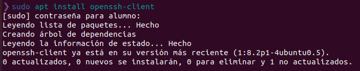
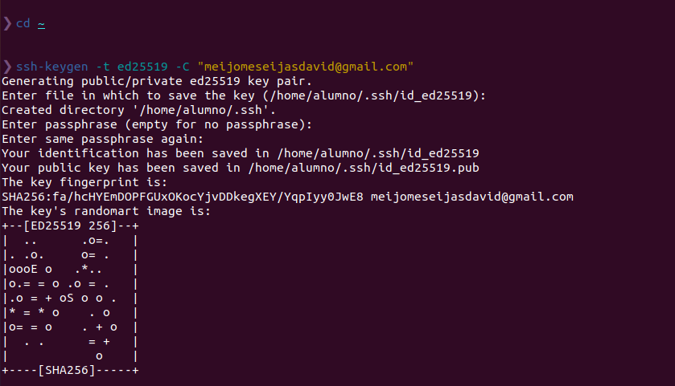
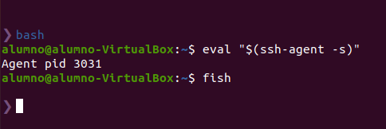
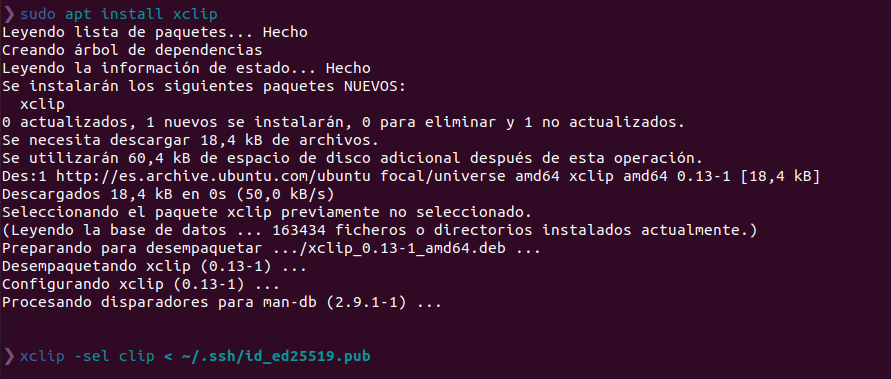
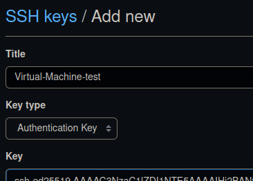
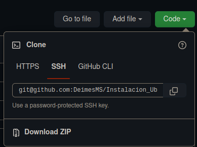
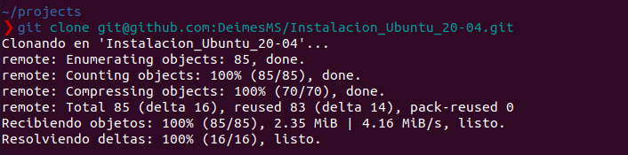

# Clonacion de un repositorio existente de Github En otro equipo

**Índice**

  - [1. Instalación de SSH](#1-instalación-de-ssh)
  - [2. Generar claves ssh](#2-generar-claves-ssh)
  - [3. Agregar nueva clave SSH a GitHub](#3-agregar-nueva-clave-ssh-a-github)
  - [4. Clonacion](#4-clonacion)

## 1. Instalación de SSH
SSH es el nombre de un protocolo y del programa que lo implementa cuya principal función es el acceso remoto a un servidor por medio de un canal seguro en el que toda la información está cifrada.

El comando es:
~~~
sudo apt install openssh-client:
~~~

## 2. Generar claves ssh

Lo primero que deberemos hacer es generar las claves SSH desde nuestro directorio home:
~~~
❯ cd ~
❯ ssh-keygen -t ed25519 -C "EMAIL_USADO_EN_REGISTRO_DE_GITHUB"
~~~

A continuacion, iniciaremos el agente SSH, todo esto desde bash:
~~~
❯ bash
$ eval "$(ssh-agent -s)"
$ fish
~~~

Agregamos la clave privada SSH al `ssh-agent`

~~~
ssh-add ~/.ssh/id_ed25519
~~~

Instalamos y usamos `xclip` para copiar al portapapeles la clave pública SSH
~~~
sudo apt install xclip
xclip -sel clip < ~/.ssh/id_ed25519.pub
~~~

## 3. Agregar nueva clave SSH a GitHub

Nos dirigiremos a GitHub y,dando por hecho que la sesion ya esta iniciada, nos iremos a los ajustes de nuestra cuenta:

En la seleccion de "Acceso", o "Access", clic en *SSH and GPG keys*, New SSH key o Agregar clave SSH:

En el campo título, agregaremos una etiqueta descriptiva para la clave, y copiaremos la clave que hemos copiado con xclip:

Y guardaremos la clave SSH

## 4. Clonacion

Ahora, nos dirigiremos al repositorio que clonaremos, copiaremos la clave SSH que encontraremos en el boton verde code:

Nos dirigiremos a la máquina donde clonaremos el repositorio, y crearemos una carpeta donde nos situaremos para la clonacion:

y en el terminal copiaremos lo siguiente:

~~~
git  clone [enlace del repositorio copiado]
~~~

### 4.1. Formatear los commits

Editaremos el ficheiro .gitconfig para formatear en una sola línea los commits cuando usamos git log.

Para ello añadiremos lo siguiente a el archivo .gitconfig:
~~~
[format]
	pretty = %C(yellow)%h%Creset %s %C(red)(%an, %cr)%Creset
~~~

## 5. Ficheros importantes

/etc/passwd
/etc/shadow
