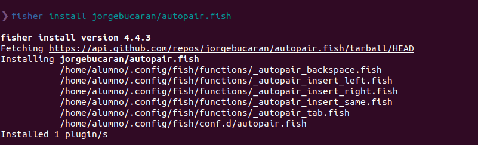

# Instalacion de Ubuntu 20.04 LTS en Virtual-Box

**Índice**
- [Instalacion de Ubuntu 20.04 LTS en Virtual-Box](#instalacion-de-ubuntu-2004-lts-en-virtual-box)
  - [1. Recursos](#1-recursos)
- [2. Pasos a seguir](#2-pasos-a-seguir)
    - [2.1 Creación de la máquina](#21-creación-de-la-máquina)
    - [2.2 Instalación](#22-instalación)
  - [3. Actualizar el sistema operativo](#3-actualizar-el-sistema-operativo)
  - [4. Instalación de Guest Additions](#4-instalación-de-guest-additions)
  - [4. Instalacion de cURL](#4-instalacion-de-curl)
    - [4.1 ¿Qué es cURL?](#41-qué-es-curl)
    - [4.2 Instalacion](#42-instalacion)
  - [5. Instalación de fish](#5-instalación-de-fish)
    - [5.1 ¿Qué es fish?](#51-qué-es-fish)
    - [5.2 Instalación](#52-instalación)
    - [5.3 Establecer fish como terminal predeterminado](#53-establecer-fish-como-terminal-predeterminado)
    - [5.4 Instalar fisher (Gestor de extensiones de fish)](#54-instalar-fisher-gestor-de-extensiones-de-fish)
      - [5.4.1 Instalar extensiones](#541-instalar-extensiones)
        - [5.4.1.1 Pure](#5411-pure)
        - [5.4.1.2 Autopair](#5412-autopair)
        - [5.4.1.3 Bax](#5413-bax)
        - [5.4.1.4 fish-ssh-agent](#5414-fish-ssh-agent)
  - [Instalacion de git](#instalacion-de-git)
   

## 1. Recursos

Para la instalación de Ubuntu, debemos tener lo siguiente:
> Una imagen ISO de Ubuntu 20.04 LTS, que descargaremos en [este enlace](https://releases.ubuntu.com/focal/).
> Virtual Box instalado en nuestro sistema, aqui el [enlace](https://www.virtualbox.org/wiki/Downloads).

# 2. Pasos a seguir

### 2.1 Creación de la máquina

Al barir el Virtual Box, clicaremos en el icono "new" o "nuevo", dependiendo del idioma que le tengamos puesto, y nos abrira la siguiente ventana:

Esto es para elegir el nombre que le pondremos a la máquina, el tipo de sistema operativo, y su version, para Ubuntu siempre es la misma, a no ser que sea de 32 bits, pero en nuestr caso es un Linux Ubuntu de 64 bits.

Luego nos pedira la cantidad de memoria RAM que tendra nuestra máquina, con 1024 MB suele ser suficiente, pero le pondremos 4096MB para que la instalación sea mas rápida:

Nos pedira si queremos crear o no un disco virtual, o usar uno ya existente, como no tenemos ninguno creado, haremos que lo cree:

Nos abrira otra pestaña mas, donde elegiremos que el disco virtual sea VDI, ya que es el mas estable:

Cuando lo elijamos, nos preguntara si queremos un disco dinamico (este funciona, como bien dice su nombre, dinamicamente, es decir, ira cogiendo espacio en el disco real segun necesite, hasta el limite que tiene marcado) o fijo (que reserva en el disco real la totalidad de GB que le hayamos marcado). Elegiremos el dinamico:

Ahora, como bien dije antes, elegiremos el tamaño del disco virtual que queremos que tenga nuestra máquina, en nuestro caso, con 10 GB es mas que suficiente:

Ahora, introduciremos la ISO anteriormente descargada en el lector de disco virtual:

Y arrancaremos la máquina virtual.

### 2.2 Instalación

Al arrancar la máquina virtual, comenzara la instalación de Ubuntu, donde:

> Elegiremos el idioma que queremos:

> La disposición del teclado:

> El tipo de instalación que quiero, en mi caso la minima:

> Si tuviermos otro sistema operativo instalado, podriamos instalarlo junto a el, en nuestro caso no, así que borraremos el disco e instalaremos Ubuntu:

> Elegiremos la zona horaria que tenemos o deseemos tener:

> Introduciremos nuestro nombre, el del usuario del equipo y su contraseña:

> Y comenzaremos la instalación:

Una vez finalizada la instalacion saldra un mensaje de que requiere de un reinicio, despues de eso tendremos Ubuntu 20.04 LTS instalado en la máquina virtual, y podremos usarlo en su totalidad.

## 3. Actualizar el sistema operativo

Para ello, solo necesitaremos 2 comandos

~~~
sudo apt-get update
~~~
Este comando buscara si tenemos algun repositorio desactualizado

~~~
sudo apt-get upgrade
~~~

Este nos instalara las actualizaciones de las aplicaciones de nuestro sistema.

## 4. Instalación de Guest Additions

Cuando terminemos de instalar la máquina, vamos a instalarle unas extensiones para que a nuestra máquina podamos meterle USB, compartir carpetas, etc.

Para ello nos dirigiremos a la pestaña de "Devices" o "Dispositivos", según el idioma, e insertaremos las Guest Additions:

Una vez se inserte, automaticamente nos saltara una alerta preguntandonos si queremos ejecutarlo, al hacerlo nos preguntara la contraseña del administrador, tambien la pondremos, y continuaremos:

Esto abrira la ventana de comandosdonde realizara la instalación, y luego requerira un reinicio para que funcione las Guest Additions:

 
Una vez hecho todo lo anterior tendremos nuestra máquina preparada.

## 4. Instalacion de cURL

### 4.1 ¿Qué es cURL?

cURL es una herramienta de línea de comandos y bibliotecas con la cual es posible transferir datos a través de una URL con diversas opciones de seguridad.

La utilidad cURL hace uso de líneas de comandos o scripts para llevar a cabo la transferencia de los datos, es por ello que es una de las herramientas más populares. 

### 4.2 Instalacion

Lo primero que deberemos hacer es actualizar los repositorios de Ubuntu, para ello usaremos el comando:

 ~~~
sudo apt update
~~~

Luego comenzaremos la instalacion de curl con el comando:

~~~
sudo apt install curl
~~~

## 5. Instalación de fish

### 5.1 ¿Qué es fish?

Es un shell en linea de comandos inteligente y facil de usar para sistemas operativos  Linux, macOS y el resto de la familia

### 5.2 Instalación

Deberemos añadir el repositorio de fish a nuestra lista de repositorios de Ubuntu:
 
~~~
sudo apt-add-repository ppa:fish-shell/release-3 
~~~

Luego, actualizaremos el repositorio

~~~
sudo apt-get update && sudo apt-get upgrade
~~~

Una vez hecho esto, instalaremos fish shell

~~~
sudo apt install fish
~~~

### 5.3 Establecer fish como terminal predeterminado

Para ello, usaremos el siguiente comando:

~~~
which fish
~~~

Esto nos dira la ubicacón de fish, lo cual necesitaremos parea el siguiente comando:

~~~
chsh -s [ruta de instalacion]
~~~
La ruta de instalacion, es lo que nos mostro el comando `which`

Reiniciaremos la máquina, y tendremos el terminal fish predeterminado:

### 5.4 Instalar fisher (Gestor de extensiones de fish)

Deberemos meternos en shell de fish, para ello:

~~~
fish
~~~

Y ejectaremos el comando para instalar el gestor:

~~~
curl -sL https://git.io/fisher | source && fisher install jorgebucaran/fisher
~~~

#### 5.4.1 Instalar extensiones

##### 5.4.1.1 Pure
Para su instalación, usaremos los siguentes comandos:
~~~
curl -sL https://git.io/fisher | source && fisher install jorgebucaran/fisher
fisher install jorgebucaran/nvm.fish
~~~

Ahora, procederemos a instalar pure:

~~~
fisher install pure-fish/pure
~~~

 
Ahora, tendremos un terminal fish mas comodo, con el que podreemos autocompletar los comandos que ya hemos usado:

##### 5.4.1.2 Autopair

Esta extension sirve para autocompletar *( ), [ ], { }, " "*, y *' '*.
~~~
fisher install jorgebucaran/autopair.fish
~~~

##### 5.4.1.3 Bax

Sirve para ejecutar scripts bash en fish

~~~
fisher install jorgebucaran/fish-bax
~~~

##### 5.4.1.4 fish-ssh-agent

Util para iniciar el agente ssh

~~~
fisher install danhper/fish-ssh-agent
~~~

## Instalacion de git

Añadiremos el repositorio de git a nuestro ordenador, actualizaremos los repositorios e instalaremos git con los siguientes comandos:

~~~
sudo add-apt-repository ppa:git-core/ppa
sudo apt update
sudo apt install git
~~~

Comprobaremos que la instalacion haya sido correcta con: 

~~~
git version
~~~

Ahora comnfiguraremos el nombre, el email, el editor y el defaultBranch:

~~~
cd ~
git config --global user.name "AQUI VA TU NOMBRE"
git config --global user.email AQUI_VA_TU_EMAIL@WHATEVER.COM
git config --global core.editor AQUI_VA_TU_EDITOR
git config --global init.defaultBranch main
~~~

Para comprobar que todo ha quedado configurado correctamente:
~~~
git config --list --show-origin
~~~

