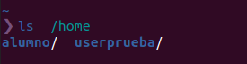
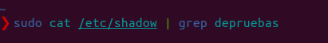
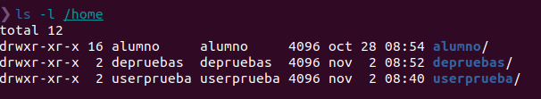
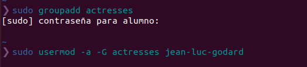
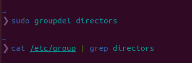

# Usuarios, grupos, `/etc/passwd` y `/etc/shadow`
- [Usuarios, grupos, `/etc/passwd` y `/etc/shadow`](#usuarios-grupos-etcpasswd-y-etcshadow)
  - [1. Fichero /etc/passwd](#1-fichero-etcpasswd)
    - [1.1 ¿Qué es el fichero /etc/passwd?](#11-qué-es-el-fichero-etcpasswd)
    - [1.2 Formato del archivo](#12-formato-del-archivo)
    - [1.3 Relacion con el comando `chsh -s`](#13-relacion-con-el-comando-chsh--s)
      - [1.3.1 ¿Qué és `chsh`?](#131-qué-és-chsh)
  - [2. Fichero /etc/shadow](#2-fichero-etcshadow)
    - [2.1 ¿Que és el fichero /etc/shadow?](#21-que-és-el-fichero-etcshadow)
    - [2.2 Formato del archivo](#22-formato-del-archivo)
    - [2.3 Relacion con el comando chsh](#23-relacion-con-el-comando-chsh)
  - [3. Comando useradd](#3-comando-useradd)
    - [3.1 ¿Que es?](#31-que-es)
    - [3.2 Funcionamiento](#32-funcionamiento)
  - [4. Comando adduser](#4-comando-adduser)
    - [4.1 ¿Que és?](#41-que-és)
    - [4.2 Funcionamiento](#42-funcionamiento)
  - [5. Comando userdel](#5-comando-userdel)
  - [6. Creacion de *depruebas* con adduser](#6-creacion-de-depruebas-con-adduser)
  - [7. Eliminacion depruebas con userdel](#7-eliminacion-depruebas-con-userdel)
  - [8. ¿Que es /etc/skel?](#8-que-es-etcskel)
  - [9. ¿Que es /etc/group?](#9-que-es-etcgroup)
  - [10. Añadiendo los usuarios a los grupos](#10-añadiendo-los-usuarios-a-los-grupos)
  - [11. Flags de usermod](#11-flags-de-usermod)
  - [12. Eliminar usuarios de grupos](#12-eliminar-usuarios-de-grupos)
  - [13. Eliminacion de grupos](#13-eliminacion-de-grupos)
  - [14. Comando `chage`](#14-comando-chage)
  - [14.1 Cambiar validez de contraseña](#141-cambiar-validez-de-contraseña)
  - [15. Permisos de carpeta](#15-permisos-de-carpeta)
    - [15.1 Ejemplo](#151-ejemplo)
  - [16. Cambio de propetario de carpeta o archivo](#16-cambio-de-propetario-de-carpeta-o-archivo)
    - [16.1 Ejemplo](#161-ejemplo)


## 1. Fichero /etc/passwd


### 1.1 ¿Qué es el fichero /etc/passwd?
Este fichero almacena información esencial, que se requiere durante el inicio de sesión en linux. En otras palabras, almacena información de la cuenta del usuario. /etc/passwd es un archivo de texto sin formato. Contiene una lista de las cuentas del sistema, que proporciona información útil para cada cuenta, como ID de usuario, ID de grupo, directorio de inicio, shell y más.

El archivo /etc/passwd debe tener permiso de lectura general, ya que muchas utilidades de comando lo usan para asignar ID de usuario a nombres de usuario. Sin embargo, el acceso de escritura a /etc/passwd solo debe limitarse para la cuenta de superuser/root. 

### 1.2 Formato del archivo

Contiene una entrada por línea para cada usuario (cuenta de usuario) del sistema. Todos los campos están separados por un. Total de siete campos de la siguiente manera.


**Nombre de usuario:** se utiliza cuando el usuario inicia sesión. Debe tener entre 1 y 32 caracteres de longitud.

**Contraseña:** un carácter x indica que la contraseña cifrada se almacena en el archivo /etc/shadow. Tenga en cuenta que debe usar el comando passwd para calcular el hash de una contraseña escrita en la CLI o para almacenar / actualizar el hash de la contraseña en el archivo /etc/shadow.

**ID de usuario (UID):** a cada usuario se le debe asignar una ID de usuario (UID). El UID 0 (cero) está reservado para root y los UID 1-99 están reservados para otras cuentas predefinidas. El sistema reserva UID 100-999 adicionales para cuentas / grupos administrativos y del sistema.

**ID de grupo (GID):** la ID de grupo principal (almacenada en /etc/group file)

**Información de ID de usuario:** el campo de comentario. Le permite agregar información adicional sobre los usuarios, como el nombre completo del usuario, el número de teléfono, etc. Este campo se utiliza mediante un comando de dedo.
Directorio de inicio: la ruta absoluta al directorio en el que estará el usuario cuando inicie sesión. Si este directorio no existe, el directorio de usuarios se convierte en /.

**Comando/shell:** la ruta absoluta de un comando o shell (/bin/bash). Típicamente, esto es un caparazón. Tenga en cuenta que no tiene que ser un shell

### 1.3 Relacion con el comando `chsh -s`

#### 1.3.1 ¿Qué és `chsh`?

El comando `chsh -s` se utiliza para cambiar el shell predeterminado, que por defecto suele ser bash, a, por ejemplo fish, como shell predeterminada, el cual, marca el fichero/ec/passwd, y al cambiarlo, cambia al usar el comando.

Su sintaxis es:
```sh
chsh -s (para marcar que vas a cambiar la consola del propio usuario) /usr/bin/(nombre del shell que estableceras)
```

Un ejemplo del comando seria:

```sh
chsh -s /usr/bin/fish
```

## 2. Fichero /etc/shadow

### 2.1 ¿Que és el fichero /etc/shadow?

Originalmente, la contraseña cifrada se almacenaba en /etc/passwd que tenía que ser legible en todo el mundo para que el sistema pudiera asignar los ID de usuario a los nombres de usuario, y para que los usuarios pudieran encontrar información sobre los demás y luego la gente se diera cuenta de que se trataba de un problema de seguridad. Entonces un nuevo archivo /etc/shadow fue creado para almacenar la contraseña encriptada que es legible solo por root y también contiene otra información que el /etc/passwd. El archivo no se admite en relación con la cuenta y la contraseña del usuario, por ejemplo, cuándo se cambió la contraseña por última vez y cuándo caducará. Este archivo oculta los hash a los usuarios normales del sistema y los mantiene disponibles para fines de autenticación de usuarios.

En Linux, cuando crea un usuario (utilizando el comando useradd), la información de la cuenta, como el nombre de usuario, UID, GID, etc., se almacena en un archivo del sistema / etc / passwd y la información de la cuenta segura, como la contraseña cifrada, la última modificación, la fecha de caducidad, etc. almacenado en otro archivo llamado / etc / shadow.

Cada usuario del sistema tendrá una entrada en el archivo / etc / shadow. Hay 8 campos por línea, cada uno separado por «dos puntos:». Una entrada de muestra es la siguiente.


### 2.2 Formato del archivo


**Nombre de usuario o inicio de sesión:** Este primer campo denota el nombre de usuario que debe usarse al iniciar sesión en el sistema.

**Contraseña:** El segundo campo almacena la contraseña en formato cifrado. la $ xx $ inicial$ 6 $ para el ejemplo anterior) justo después del primer campo (raíz:) indica el tipo de cifrado. Como se señaló anteriormente, el asterisco * significa que esta cuenta no se puede utilizar para iniciar sesión y el !! significa que el usuario no tiene contraseña, por lo que ha sido creado sin contraseña.

**Fecha del último cambio de contraseña (último cambio):** El tercer campo indica la fecha del último cambio de contraseña, expresada como el número de días desde el 1 de enero de 1970. El valor 0 significa que el usuario debe cambiar su contraseña la próxima vez que inicie sesión en el sistema.

**Días mínimos:** Este cuarto campo almacena el número mínimo de días después de los cuales un usuario puede cambiar su contraseña. No podrá cambiar la contraseña antes de eso.

**Días máximos:** Este quinto campo indica el número máximo de días que la contraseña es válida. Después de eso, el usuario se ve obligado a cambiar su contraseña.

**Período de advertencia de la contraseña:** El sexto campo indica el número de días antes de los cuales el usuario recibirá una notificación de advertencia sobre la caducidad de la contraseña y debe cambiarse.

**Periodo de inactividad:** El séptimo campo indica el número de días después de la expiración de la contraseña después de los cuales se deshabilitará la cuenta. Cuando está vacío, este campo indica que no hay cumplimiento de un período de inactividad.

**Fecha de caducidad:** El octavo campo indica los días desde el 1 de enero de 1970 en que la cuenta está deshabilitada.
Reservado: el noveno campo está reservado para uso futuro.

### 2.3 Relacion con el comando chsh 

No tiene ninguna relacion con el archivo, ya que el comando `chsh` solo afecta al archivo `/etc/passwd`, por lo tanto tampoco puedo poner ningun tipo de ejemplo.

## 3. Comando useradd

### 3.1 ¿Que es?

Es un comando que se utiliza para crear cuentas de usuarios en linux. Estas cuentas se configuran por medio de parametros:

```sh
Nombre de la cuenta
Id de usuario
Id de grupo
Nombre de la persona o servicio
Directorio personal o home
Shell a usar
```

### 3.2 Funcionamiento

Crear un usuario con `userad` es simple, lo unico que deberemos hacer escribir lo siguiente:

```sh
sudo useradd nombre_de_usuario
```

OJO: que así solo creamos el usuario, pero sin contraseña, sin interprete de comandos, sin directorio de usuario, por lo que este metodo no nos vale

Para crear unusuario completo debemos:
```sh
sudo useradd -m -d /home/depruebas depruebas -s /bin/bash
```

Con esto creamos su home en `/home` y establecemos su terminal en bash, pero no tiene contraseña, para ello necesitamos del archivo **passwd** anteriormente mencionado:
```sh
sudo passwd depruebas
```

Asi estableceremos la contraseña para nuestro usuario, lo cual hara ue se guarde en el fichero `/etc/shadow` de forma cifrada


## 4. Comando adduser
### 4.1 ¿Que és?

El comando adduser en Linux se usa para agregar un nuevo usuario a su máquina Linux actual. Este comando le permite modificar las configuraciones del usuario que se va a crear. Es similar al comando useradd en Linux. El comando adduser es mucho más interactivo en comparación con el comando useradd.

### 4.2 Funcionamiento

Es bastante mas simple que con el useradd, ya que este te ira preguntando los datos, y hara todo mas automaticamente, lo que si, es que deberemos establcerle nosotros el terminal, o meterlo todo junto en el mismo comando:
```sh
sudo adduser userprueba --shell /bin/sh
```


## 5. Comando userdel
Este comando nos permite eliminar usuarios, siempre y cuando tengamos permisos de root, su sintaxis es la siguiente:

```sh
userdel [OPTIONS] USERNAME
```

Entre las opciones que contiene esete comando, cabe destacar:

  **-r**: este elimina al usuario, pero no sus archivos

  **-f**: este indica al comando que fuerce la eliminacion del usuario

```sh
userdel -r depruebas
```




Veremos que al eliminarlo, desaparecera su configuración deñ archivo



Al eliminarlo su contraseña cifrada no es necesaria, y es por eso que no aparece en el archivo

## 6. Creacion de *depruebas* con adduser

```sh
ls -l /home
```


```sh
sudo adduser depruebas --shel /bin/bash
```


```sh
ls -l home
```



## 7. Eliminacion depruebas con userdel

```sh
ls -l /home
```


```sh
sudo userdel -r depruebas
```


## 8. ¿Que es /etc/skel?

Es bastante simple de configurar y usar. Proporciona una forma de estar seguro de que todos los nuevos usuarios de tu sistema LFS tienen la misma configuración inicial. El directorio /etc/skel es usado por el programa /usr/sbin/useradd.


## 9. ¿Que es /etc/group?

Contiene los nombres de los grupos y una lisa de los usuarios que pertenecen a cada grupo. Cada línea representa un grupo y contiene 4 campos:

    El nombre del grupo (es recomendable que no tenga más de 8 caracteres).
    La contraseña cifrada o bien una x que indica la existencia de un archivo gshadow.
    Le número de GID
    Lista de los miembros del grupo, separados por comas (sin espacios)


## 10. Añadiendo los usuarios a los grupos


El cambio que a tenido, a sido la creacion del propio grupo, y los añadidos de los usuarios


Aparte de la creacion de los usuarios, vemos que estes tienen el grupo `directors`, el cual hemos creado y le hemos añadido a esos tres usuarios

## 11. Flags de usermod

**-a**: es un atajo para --append. Significa agregar el grupo a la lista de grupos a los que pertenece el usuario

**-G**: es un atajo para --groups. le dice a usermod que el siguiente argumento es un grupo. Tener en cuenta que debe usar una -G mayúscula aquí porque no queremos modificar el grupo principal del usuario, sino la lista de grupos complementarios a los que pertenece el usuario.



Lo primero es crear el grupo, y luego añadir al usuario al grupo

## 12. Eliminar usuarios de grupos

Para eliminar al usuario de uno de esos grupos, puede invocar el comando gpasswd con el –Eliminar bandera seguido por el usuario que se eliminará y el grupo.

```sh
sudo gpasswd --delete [nombre usuario] [nombre grupo]
```

Unos ejemplos serian:

```sh
sudo gpasswd --delete jean-luc-godard directors
sudo gpasswd --delete andrei-tarkovsky directors
```


## 13. Eliminacion de grupos

```sh
sudo groupdel [nombre-grupo]
```

**Importante:** Este comando verificará que el grupo newbie no es grupo principal de ningún usuario, de lo contrario no se nos permitirá eliminarlo.

**Nota:** Cuando eliminamos un grupo, quizás nos interese saber si existen archivos cuyo grupo principal es el grupo a eliminar.




## 14. Comando `chage`

El comando chage nos permite configurar el vencimiento de la contraseña de un usuario, así como establecer la caducidad de la cuenta de un usuario. El sistema utiliza esta información para determinar cuándo un usuario debe cambiar su contraseña.

Para ver toda la informacion de la contraseña de un usuario es:

```sh
sudo chage -l juliet-berto
```


## 14.1 Cambiar validez de contraseña

Para cambiar la validez es con el comando:

```sh
sudo chage -m [duracion en dias] -M [duracion en dias] [nombre-usuario]
```


## 15. Permisos de carpeta

Para establecer permisos a un usuario en una carpeta usamos el comando `chmod`, donde establecemos si puede escribir, leer o ejecutar:

```sh
sudo chmod [permisos] [documento o carpeta]
```

**r:** Permiso de lectura (read); también llamado bit R

**w:** Permiso de escritura (write); también llamado bit W

**x:** Permiso de ejecución (execute); también llamado bit X

**Carácter para clases de usuarios:** Significado

**u**: user, propietario

**g:** group, grupo

**o:** other, otros

**a:** all, todas las clases

### 15.1 Ejemplo

Crearemos una carpeta para el ejemplo, empleando el mkdir, y ejecutamos el comando:

```sh
sudo chmod 666 projects/
```

Y al hacer un ls -l:


## 16. Cambio de propetario de carpeta o archivo

```sh
chown [opciones] nuevo_usuario nombre_de_archivo/directorio
```

OPCIONES:

**-R:** 	Cambia el permiso en archivos que estén en subdirectorios del directorio en el que estés en ese momento.

**-c:** 	Cambia el permiso para cada archivo.

**-f:** 	Previene a chown de mostrar mensajes de error cuando es incapaz de cambiar la titularidad de un archivo. 


### 16.1 Ejemplo
```sh
chown -R juliet-berto projects/
```

